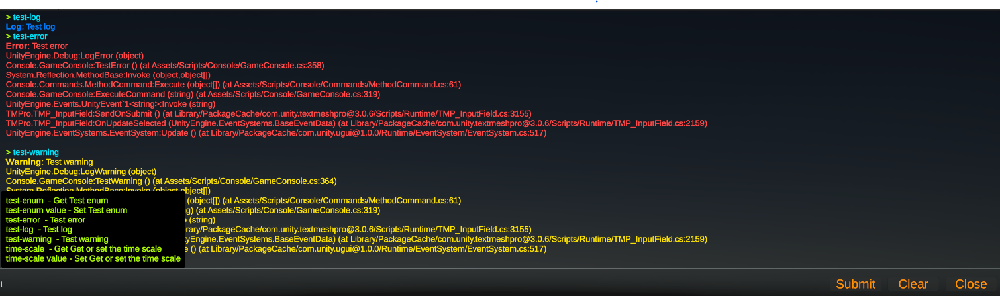

# Unity Game Console

The `GameConsole` class provides an in-game console for executing commands, displaying output, and managing console UI elements.




## Features
- Execute commands
- Display logs
- Suggestions
- Autocomplete with `Tab`
- History of used commands `Up` and `Down` arrows
- Allows to run command on single or multiple objects
- Commands can be applied on methods and properties

## Properties

- **consoleCanvas**: The `Canvas` component that contains the console UI.
- **style**: The `GameConsoleStyle` object that defines the console's visual style.
- **backgroundImage**: The `Image` component for the console's background.
- **textField**: The `TextMeshProUGUI` component for displaying console output.
- **textBackgroundImage**: The `Image` component for the background of the text field.
- **commandInputTextField**: The `TMP_InputField` component for entering commands.
- **commandTextField**: The `TextMeshProUGUI` component for displaying the current command.
- **commandBackgroundImage**: The `Image` component for the background of the command input field.
- **openConsoleKey**: The `KeyCode` used to toggle the console.
- **foregroundControlsGraphics**: An array of `Graphic` components for the foreground controls.
- **backgroundControlsGraphics**: An array of `Graphic` components for the background controls.
- **captureLogsToConsole**: An array of `LogType` log types to print in console

## Methods

- **Awake**: Initializes the console text field and performs cleanup.
- **Start**: Initializes command and converter collections and applies the style settings.
- **OnEnable**: Adds listeners for command input changes and submission.
- **OnDisable**: Removes listeners for command input changes and submission.
- **GetCommands**: Lists all available commands.
- **Print**: Prints text to the console.
- **PrintError**: Prints an error message to the console.
- **ExecuteCurrentCommand**: Executes the current command in the input field.
- **Clear**: Clears the console output.
- **Close**: Closes the console UI.
- **Open**: Opens the console UI.
- **Update**: Handles input for toggling the console and autocompleting commands.
- **ExecuteCommand**: Executes a specified command.
- **Cleanup**: Resets the input field and suggestion container.
- **GetCommands**: Retrieves commands matching the input text.


## Usage

1. **Add `GameConsole` to the Scene**:
   - Create an empty GameObject and attach the `GameConsole` component or use included prefab.
   - Configure the `consoleCanvas`, `style`, and other properties as needed.

2. **Open and Close the Console**:
   - Press the key specified in `openConsoleKey` (default is BackQuote) to toggle the console.

3. **Execute Commands**:
   - Type a command in the input field and press Enter to execute it.
   - Use the `list-commands` command to see all available commands.
   - Use the `clear` command to clear the console output.

4. **Autocomplete Commands**:
   - Press `Tab` to autocomplete the current command.

5. **Commands hisotry**:
   - Use the `Up` and `Down` arrow keys to navigate through the command history.

6. **Customize Console Style**:
   - Modify the `GameConsoleStyle` object to change the appearance of the console.

## Creating Commands using CommandAttribute
The `CommandAttribute` is used to define commands that can be executed in the `GameConsole`.
### Example
```
public class GameCommands : MonoBehaviour
{
    [Command("greet", "Prints a greeting message")]
    public void Greet()
    {
        Debug.Log("Hello, Player!");
    }

    [Command("add", "Adds two numbers")]
    public int Add(int a, int b)
    {
        return a + b;
    }
}
```
### Usage
1. **Define Commands**:  
    - Use the CommandAttribute to mark methods, properties, or fields as console commands.
2. **Execute Commands**:
    - Type the command name in the console input field and press Enter to execute it.

## Creating Value Converters
The `IValueConverter` interface is used to create custom value converters for converting between strings and specific types. Converters are automatically loaded and registered by the `ValueConverterCollection`

### Example
```
public class CustomValueConverter : IValueConverter
{
    public Type Type => typeof(CustomType);

    public object Convert(string value)
    {
        // Implement conversion from string to CustomType
    }

    public string Convert(object value)
    {
        // Implement conversion from CustomType to string
    }
}
```

### Built-in Converters
The following built-in converters are available:  
- ByteValueConverter
- ShortValueConverter
- IntValueConverter
- LongValueConverter
- FloatValueConverter
- DoubleValueConverter
- StringValueConverter
- BoolValueConverter
- DateTimeValueConverter
- Vector2ValueConverter
- Vector3ValueConverter
- Vector4ValueConverter
- ColorValueConverter
- Vector2IntValueConverter
- Vector3IntValueConverter
- QuaternionValueConverter
- RectValueConverter
- BoundsValueConverter
- EnumValueConverter
- GameObjectValueConverter

## Creating Suggestions
The `SuggestionCollection` is a collection of various suggestion providers used in commands that implement the ISuggestion interface. Each suggestion provider is responsible for generating a list of suggestions based on a given input and type. 

The `SuggestionCollection` automatically includes all suggestion providers that can be created with a parameterless constructor. If a suggestion provider requires parameters for its constructor, it should be added to the dictionary passed to the `SuggestionCollection` constructor. 
In `GameConsoleSuggestionController` there is method `WaitForCommands` which creates  `SuggestionCollection` there you can add your custom implementations.

### Example
```
_suggestionCollection = new SuggestionCollection(new Dictionary<Type, ISuggestion>
{
    {typeof(ICommand), new CommandSuggestion(gameConsole.Commands)}
});
```

### Built-in Sugestions
- LongSuggestion
- FloatSuggestion
- DoubleSuggestion
- StringSuggestion
- BoolSuggestion
- DateTimeSuggestion
- Vector2Suggestion
- Vector3Suggestion
- Vector4Suggestion
- ColorSuggestion
- Vector2IntSuggestion
- Vector3IntSuggestion
- GameObjectSuggestion
- EnumSuggestion


## Example of custom command with custom type as input
### Command
```
[Command("spawn-prefab", "Spawn a prefab works only in unity editor", "UnityEngine", CommandTargetType.Single)]
public static string SpawnPrefab(PrefabResource prefabResource, string name)
{
    try
    {
        var prefab = Resources.Load<GameObject>(prefabResource.Path);
        var spawnedObject = Instantiate(prefab);
        spawnedObject.name = name;
        return spawnedObject.name;
    }
    catch
    {
        return "Prefab not found.";
    }
}
```
### Custom type
```
public struct PrefabResource
{
    public readonly string Path;

    public PrefabResource(string path)
    {
        Path = path;
    }
    
    public class PrefabResourceSuggestions : ISuggestion
    {
        public Type Type => typeof(PrefabResource);
        private readonly List<string> _cachedGameObjects;

        public PrefabResourceSuggestions()
        {
            var prefabGuids = UnityEditor.AssetDatabase.FindAssets("t:Prefab", new[] { "Assets/Resources" });

            // Get the names of the prefabs without loading them
            _cachedGameObjects = prefabGuids
                .Select(UnityEditor.AssetDatabase.GUIDToAssetPath)
                .Select(x => x.Replace("Assets/Resources/", "").Replace(".prefab", ""))
                .ToList();
        }

        public List<string> GetSuggestions(Type type, string input)
        {
            input = input.Trim('"');
            if(string.IsNullOrWhiteSpace(input))
            {
                return new List<string>();
            }
        
            return _cachedGameObjects
                .Where(x => x.StartsWith(input, StringComparison.OrdinalIgnoreCase))
                .OrderBy(x => x)
                .ToList();
        }
    }
    
    public class PrefabResourceConverter : IValueConverter
    {
        public Type Type => typeof(PrefabResource);

        public object Convert(string input)
        {
            return new PrefabResource(input);
        }

        public string Convert(object value)
        {
            return ((PrefabResource) value).Path;
        }
    }
}
```